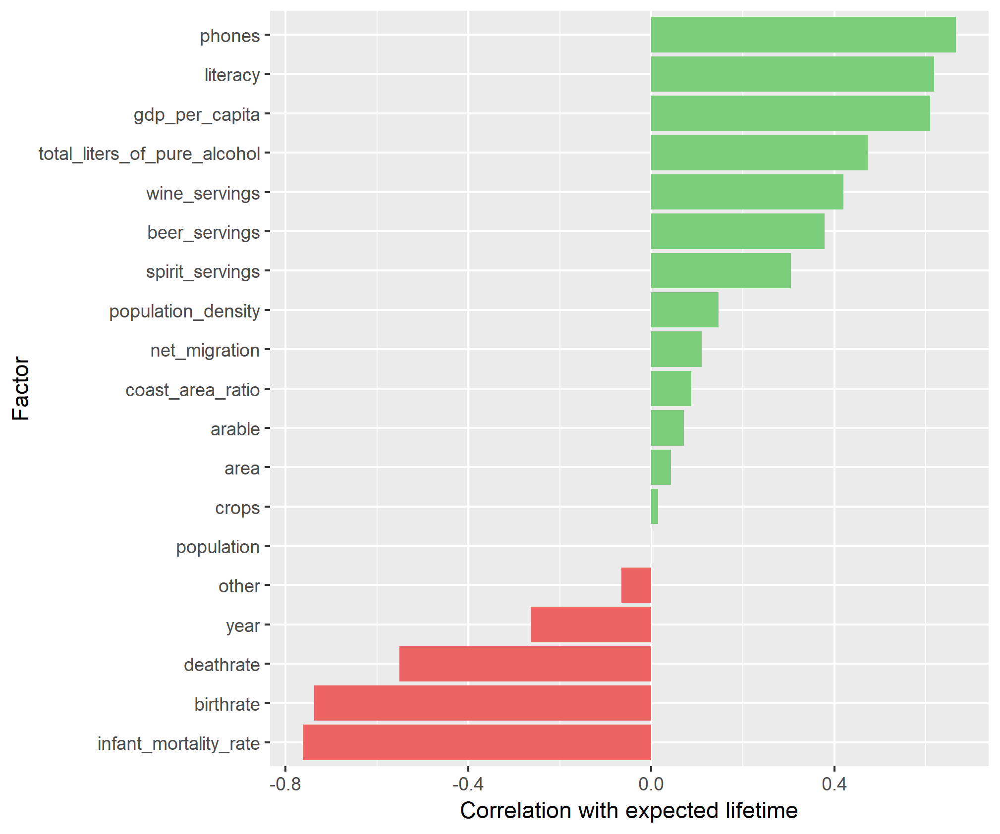

# CEU - Mastering the Process of Data Science

Analysis of the correlation between average expected lifetime and other factors with an emphasis on data cleaning from multiple noisy datasets.

This analysis was created as the final assignment for *Mastering the Process of Data Science* at CEU, Budapest in the 2019 Spring trimester.

#### Table of contents

- [Data preparation](#data-preparation)
- [Analysis](#analysis)

## Data Preparation

The full code for data preparation can be found in the **[data-preparation.R](data-preparation.R)** file.

___

The following packages were used to perform data wrangling: `dplyr`, `tibble`, `stringr` and `readxl`.

- **Drinks.csv**

  - A new variable called `total_liters_of_pure_alcohol` was created based on alcohol consumption (`?`s converted to `NA`s) and the corresponding ounces and alcohol levels.
  - Rows with `NA`s were omitted.

- **LifeExpectancy.csv**

  - I omitted the records without information regarding `income_group` and transformed the values to a factor with readable levels (removed the `_income` suffix).
  - I added 60 to the `Life expectancy at age 60 (years)` metric to have all three life expectancy metrics on the same level.
  - Out of the three metrics I created a fourth one, called `avg_life_expectancy` that takes the mean of the values per country and sex.

- **CountriesOfTheWorld.xls**

  - Headers spreaded over two rows in the spreadsheet, and the table didn't start in the first row, but the fourth.
  - As some of the variables (`literacy`, `arable`, `crops`, `other`) were percentages, these were divided by 100.
  
## Analysis

The full code for the analysis can be found in the **[analysis.R](analysis.R)** file.

___

The following packages were used to perform analysis: `corrr` and `ggplot2`.

I joined the datasets on `country`.

### Correlation between expected lifetime and total liters of pure alcohol

```r
res <- data %>% 
  select_if(is.numeric) %>%  
  correlate() %>% 
  focus(avg_life_expectancy)

res %>% 
  filter(rowname == "total_liters_of_pure_alcohol")
```

The correlation between life expectancy and total liters of pure alcohol consumed is very low, it seems like there's little to no correlaction between the two variables based on the available data.

### Factors that are highly correlated to the expected lifetime



We can draw some conclusions based on this chart:

- Neither one of the alcohol consumptions seem to have a large impact on the expected lifetime, but while drinking more wine (`wine_servings`) or spirits (`spirit_servings`) have a positive effect, drinking beer (`beer_servings`) shortens life expectancy. This coincides with traditional home remedies, a glass of wine is good for circulation, while a shot of *pálinka* (Hungarian spirit) is said to cure all illnesses. :wine_glass: 
- `phones` has the highest positive correlation with life expectancy, meaning if there are more phones in a country, people will live longer. This makes sense since citizens of wealthier countries typically have more phones than those in poor ones.
- `literacy` and `gdp_per_capita` are usually also associated with wealthier countries where due to the better circumstances, people tend to live longer.
- The three highest negatively correlated factors also make a lot of sense:
  - `deathrate` or mortality rate is the scaled number of deaths in a particular population, which means when more people die, the life expectancy is lower.
  - `birthrate` is the total number of live births per 1000 in a year, and if this number is smaller, there are more deaths, which results in lower expected lifetime.
  - `infant_mortality_rate` is the death of young children under the age of 1, where the same principle applies as it did for `birthrate`.
- One interesting thing to see is the `year` variable's negative correlation with life expectancy, which is alarming. This means that life expectancy was higher in earlier readings of the metric, while lately it has been in decline.